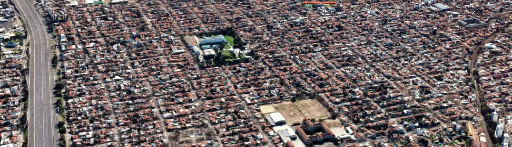
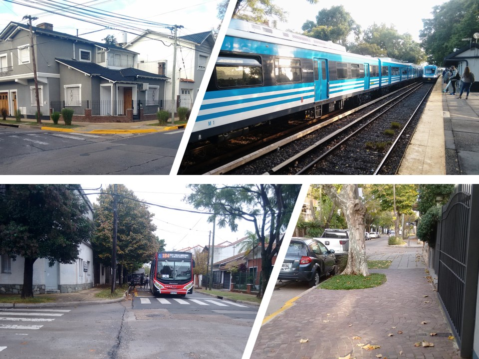
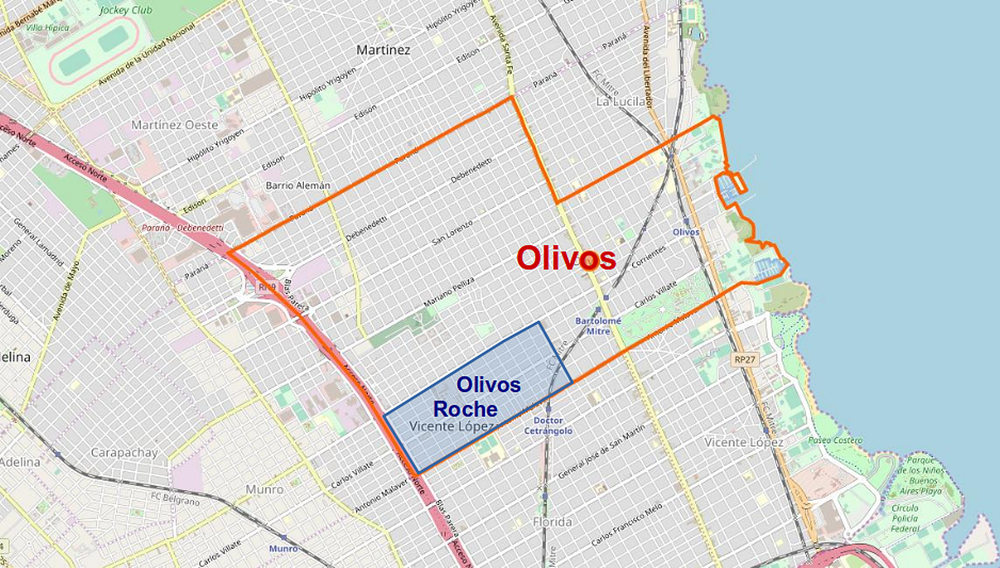
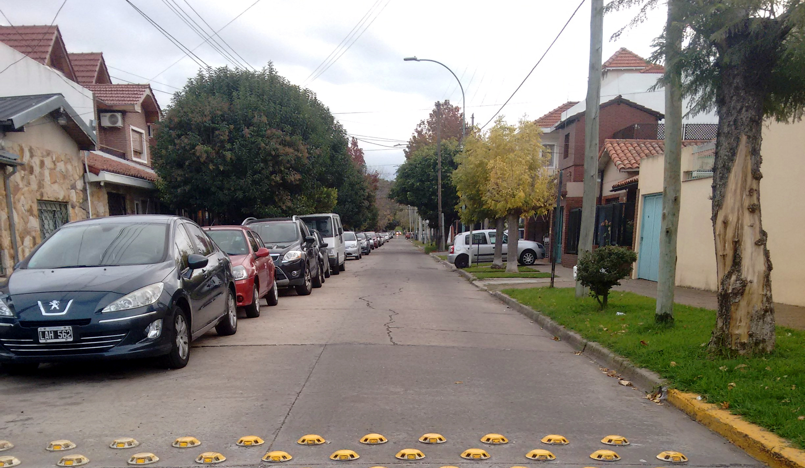
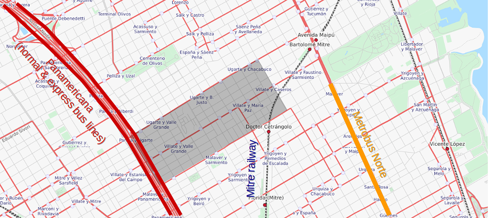
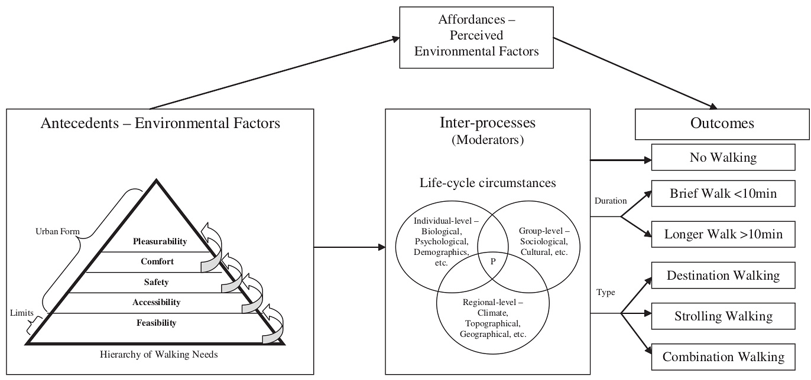
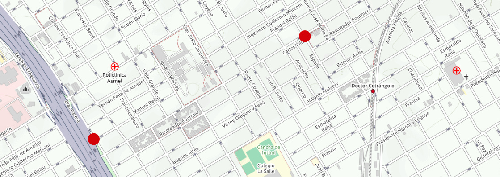
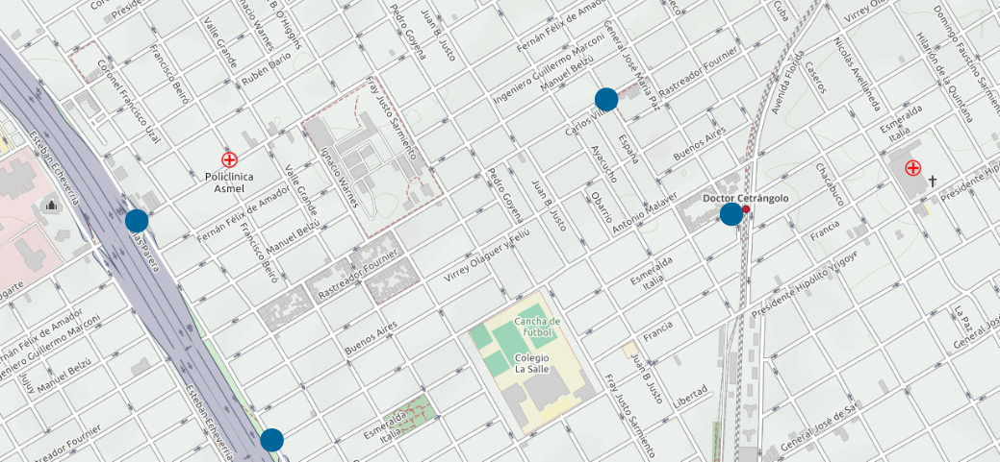
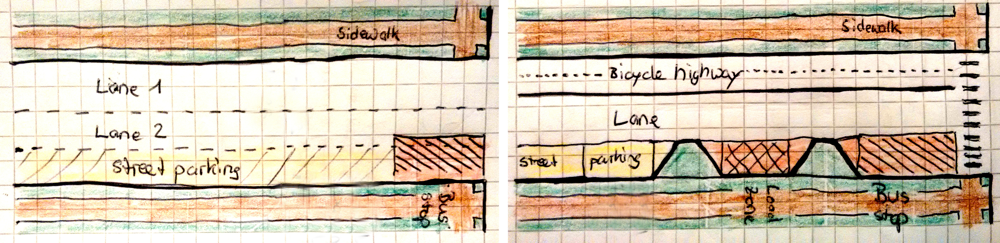
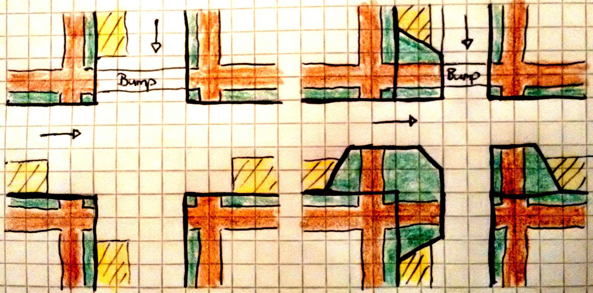

.. header:: Travel modes in Olivos Roche

.. footer:: Page ###Page### / ###Total###

.. section-numbering::
   :depth: 3

.. container:: document-title

   Olivos Roche | Travel modes

.. container:: document-subtitle

   Travel modes for disadvantaged people in Olivos Roche, Buenos Aires

.. class:: document-author
   
   Tobias Blaser

.. raw:: pdf

   PageBreak oneColumn

.. contents:: Index
   :local:
   :depth: 2

.. class:: cover-image-ref

Cover image 1: Olivos Roche (GM2019_, 2019)

.. raw:: pdf

   PageBreak

Olivos Roche
============

..
    http://openptmap.org/?zoom=14&lat=-34.52119&lon=-58.48788&layers=B0000TFT
    https://www.openstreetmap.org/relation/1270158#map=14/-34.5185/-58.5111&layers=T

    http://opencyclemap.org/?zoom=15&lat=-34.52226&lon=-58.49608&layers=B0000
    https://www.openstreetmap.org/relation/1270158#map=14/-34.5185/-58.5111&layers=C

Olivos Roche is an inofficial district of Olivos, part of the community Vicente López, Greater Buenos Aires.
It is bounded by the highway Panamericana (Acceso Norte), the collector Gobernador Manuel Ugarte, the collector Antonio Malaver and Chacabuco St.

.. list-table::
   :class: table-borderless

   * - .. figure:: images/maps/map-south-america-2.jpg
          :width: 100%

          Autonomous City Buenos Aires, Capital of Argentina, South America (OSM2019_, 2019, `1224652 <https://www.openstreetmap.org/relation/1224652#map=3/-35.96/-30.85>`_)

     - .. figure:: images/maps/map-buenos-aires-2.jpg
          :width: 100%

          Vicente López, Greater Buenos Aires, Argentina (OSM2019_, 2019, `-34.7427,-58.5201 <https://www.openstreetmap.org/#map=9/-34.7427/-58.5201>`_)
          
          .. openstreetmap.org/relation/1224657

   Olivos Roche, part of Olivos, district of Vicente López, Greater Buenos Aires (OSM2019_, 2019, `1270158 <https://www.openstreetmap.org/relation/1270158>`_)

Olivos Roche has a size of around 100 blocks and almost 9'000 inhabitants. It's density is around 90 people per hectare.

.. raw:: pdf

   PageBreak

Walking
-------

The streets and collectors are following a grid system.
All blocks count with paved sidewalks. As their maintenance is responsibility of the property owners, they are of different sizes, surfaces and qualities. 
Pedestrian crossings on collectors mostely count with curb ramps, some corners of local streets also count with them.

.. list-table::
   :class: table-borderless

   * - .. figure:: images/IMG_20190517_085325-2.jpg
          :width: 100%

          Well maintained sidewalk at Virrey Olaguer y Feliú St. / Cerro de Pasco St.

     - .. figure:: images/IMG_20190602_170014-not-maintained-sidewalk.jpg
          :width: 100%

          Not maintained sidewalk at Virrey Olaguer y Feliú St. / Fray Justo Sarmiento St.

   * - .. figure:: images/IMG_20190516_084528-2.jpg
          :width: 100%

          Curb ramps at Antonio Malaver St. / Ignacio Warnes St.

     - .. figure:: images/IMG_20190508_085213-2.jpg
          :width: 100%

          Sidewalk parking at España St. / Buenos Aires St.

Pedestrians always need to be attendant, where they put their feet, due to the changing sidewalk sizes, surface types, broken parts, wholes or animal dung.

All streets have street lighting and tree rows. In general, the streets are well lighted. But at some places, the tree rows make the sidewalk quite dark, as they cover the street lamps.

.. list-table::
   :class: table-borderless

   * - .. figure:: images/IMG_20190524_185908-night-malaver-ayacucho.jpg
          :width: 100%

          Street lighting at the corner Antonio Malaver St. / Ayacucho St., looking in direction of Maipú Avenue.

     - .. figure:: images/IMG_20190507_201029-night-malaver-warnes.jpg
          :width: 100%

          Sidewalk behind tree row at the corner Antonio Malaver St. / Ignacio Warnes St., looking in direction of Maipú Avenue.

There is not much activity on most of the streets at early and late hours, as there are not so many shops and most of them are concentrated around Carlos Villate and Gobernador Manuel Ugarte.

Cycling
-------

Olivos Roche does not yet count with public bicycle infrastructure like bicycle lanes or paths. Cyclists share the streets with cars. The collectors count with a lot of traffic around peek hours and are not comfortable to ride. 

.. list-table::
   :class: table-borderless

   * 
     - .. figure:: images/IMG_20190520_075106-malaver.jpg
          :width: 100%

          Antonio Malaver St. congested in the morning (1.75 driving lanes, 0.75 parking lanes)

     - .. figure:: images/IMG_20190518_114849-bicycle-rack.jpg
          :width: 100%

          Bicycle rack in front of a backery in Carlos Villate St.

   * - .. figure:: images/IMG_20190518_105453-normal-speed-bump.jpg
          :width: 100%

          Normal speed bump at Olaguer y Feliú St. / Villate Grande St.

     - .. figure:: images/IMG_20190517_085018-speed-humps.jpg
          :width: 100%

          Speed humps at Olaguer y Feliú St. / Juan B. Justo St.

Some collectors do not have sufficient wide lanes (e.g. 1 lane + 0.75 lane + 0.75 parking lane). This makes it dangerous to drive between the driving cars and parked cars.

Local streets on the other side, count with speed bumps every two blocks, are crossed by at-grade sewer and are interrupted at some places by the railway line or the Panamericana highway.
In the last years installed speed humps are quite dangerous for bicycles, as they need to be crossed diagonal.

   A typical local street in Olivos Roche (Rastreador Fournier St. / Ignacio Warnes St.)

In the morning or evening, bicycling may also be a security problem, as it happens from time to time, that bicyclists are assaulted on low activity streets.

There are no bicycle parking or monitored bicycle stations. Parking bicycles on the street for a longer time is not feasable, as they got stolen.

Bicycles can be taken on the train. The first and last coach contain bicycle racks to store them safely.
On the bus it's not allowed to carry the bicycle.

Scooters
--------

Electric scooter networks did not yet arrive to Olivos.
They arrived in Buenos Aires in March this year (LN2019_, 2019), but have not been seen yet in the streets.
Sidewalks end at every block and are mostly narrow and in many places broken. Not all corners count with curb ramps. So it's questionable, if scooters will be successful in Olivos, respectively in Buenos Aires in general.

Transit
-------

Olivos Roche counts with one railway line, a BRT line, express bus lines and several local bus lines:

   Metrobus Norte (BRT line north), Mitre commuter rail and Panamericana express buses (OSM2019_, 2019, `-34.5159,-58.5107 <https://www.openstreetmap.org/#map=14/-34.5159/-58.5107&layers=T>`_)

Local transit
~~~~~~~~~~~~~

Bus
...

The common bus lines are mostly driving on the collectors, some also pass through local streets.
Stops are marked with a sign at a close tree or light pole. Some stops have garbage bins or shelters.

Almost no stop has lighting or lighted advertisement panels. But some stops are well lighted by street lamps.
Also the stops do not count with any information about the route or the service frequencies.

Buses often stop far away from the curb, entering with caddy or huge bags is complicated, even for low floor buses.

.. list-table::
   :header-rows: 1

   * - Gobernador Manuel Ugarte St.
     - Carlos Villate St.
     - Antonio Malaver St.
   * - * lines 333 and 434 from Panamericana in direction of Maipú Avenue
     - * lines 333 and 434 from Maipu in direction of Panamericana
       * line 184 from station Dr. Cetrangolo / south-east in direction Panamericana
     - * line 184 from Panamericana in direction station Dr. Cetrangolo / south-east

.. list-table::
   :class: table-borderless

   * - .. figure:: images/IMG_20190505_140108-bus-stop-malaver-valle-grande.jpg
          :width: 100%

          Bus line 184 stopping at Antonio Malaver St. / Valle Grande St.

     - .. figure:: images/IMG_20190503_084944.jpg
          :width: 100%

          Bus stop at Antonio Malaver St. / General José María Paz St.
   
   * - .. figure:: images/IMG_20190516_084727.jpg
          :width: 100%

          Bus shelter at Antonio Malaver St. / Fray Justo Sarmiento St.

     - .. figure:: images/IMG_20190517_192749-2.jpg
          :width: 100%

          Bus stop at night at Antonio Malaver St. / Fray Justo Sarmiento St.

   * - .. figure:: images/bus-stop-equipment.jpg
          :width: 100%

          Bus stop equipments for all stops in Olivos Roche (local & express way)

     - .. figure:: images/IMG_20190516_084953-poor-bus-stop.jpg
          :width: 100%

          Poor bus stop at Antonio Malaver St. / Juan B. Justo St. (Plattform not paved, no shelter, grafity at the wall, no garbage bin, minimal stop sign)

Regional transit
~~~~~~~~~~~~~~~~

Mitre Railway
.............

The Mitre commuter railway connects the station Bartolomé Mitre with the main station Retiro in the city center. Close to Olivos Roche it also stops at the station Dr. Cetrangolo.
At the terminal station Bartolomé Mitre, a pedestrian bridge connects to the Terminal station of the Tren de la costa on the other side of the road, which takes passengers to Tigre in the north of Greater Buenos Aires.

.. list-table::
   :class: table-borderless

   * - .. figure:: images/IMG_20190508_090101.jpg
          :width: 100%

          Mitre commuter rail stopping in Dr. Cetrangolo

     - .. figure:: images/IMG_20180430_103155.jpg
          :width: 100%

          Mitre commuter rail train interier

* Schedules: 2 Trains per hour, ~30 services per day and direction
* Capacity: 408 seats
* Accessibility: At-grade

Panamericana bus & express lines
................................

There are several express lines on the Panamericana highway, which do not stop at all the stops and connect the passengers to the city and the north of Greater Buenos Aires.

.. list-table::
   :header-rows: 1

   * - Common bus lines
     - Express bus lines (stop only in Ugarte)
   * - .. list-table::
          :class: table-seamless
          
          * - * 365
              * 203
              * 130
              * 71
            - * 60
              * 57
              * 21
              * 15
     - * 194
       * 60 semi rápido
       * 21 semi rápido
       * 15 semi rápido

..
   https://www.xcolectivo.com.ar/colectivo/recorridos.php?linea=60

.. raw:: pdf

   PageBreak

BRT
...

On Maipu Avenue, there is a Metrobus line (BRT lime), beginning at the corner Malaver/Maipu, heading to the city center of Buenos Aires). Several bus lines serve them (152, 19, 203, 21, 59, 168, 71).

.. list-table::
   :class: table-borderless

   * - .. figure:: images/IMG_20190518_110555.jpg
          :width: 100%

          Panamericana Highway bus stop (Panamericana / Antonio Malaver)

     - .. figure:: https://www.buenosaires.gob.ar/sites/gcaba/files/styles/interna_pagina/public/_mg_2051.jpg?itok=XoeMO1cm
          :width: 100%

          Bus 152 arriving at the Metrobus stop Deheza (BAC2019_, 2019)

   * - .. figure:: https://www.buenosaires.gob.ar/sites/gcaba/files/styles/interna_pagina/public/_mg_1551.jpg
          :width: 100%

          Metrobus at-grade boarding (BAC2019_, 2019)

     - .. figure:: https://www.buenosaires.gob.ar/sites/gcaba/files/styles/interna_pagina/public/_mg_2045.jpg
          :width: 100%

          Tactile paving at Metrobus stations (BAC2019_, 2019)

Frequencies
~~~~~~~~~~~

All buslines (common & express) have frequencies between 12 and one services per hour. Frequently, buses get delayed by rail barriers, congestion or amiss parked cars. So it may happen, that people need to wait 20 minutes and then two buses arrive in tandem.

.. raw:: pdf

   PageBreak

Fares
~~~~~

In general, transit is cheap in Buenos Aires, compared to other services. Prices raise stagged by the distance, but the first stage is quite long. Currently (26/05/19) the prices for the first stage are as follows:

.. list-table::   
   :header-rows: 1

   * -
     - Price (ARS)
     - Price (USD by 26/05/19)
   * - Mitre railway
     - $18
     - U$S 0.40
   * - Bus
     - $12.25
     - U$S 0.25
   * - Express bus (+25%)
     - $22.5
     - U$S 0.50
   * - Express bus on highway (+75%)
     - $31.5
     - U$S 0.70
     
The median income in Argentina was ARS $16'293 per month (~USD $468.-) for the first term 2018 (PN2018_, 2018), what is about 10% of the median income for the United States and 9% for Switzerland (GPD2018_, 2018) at the same time. Compared to Switzerland, the fares in Buenos Aires are still more then 50% cheaper, in relation to the median  salary.

Taxi, Radio Taxi, Uber and Cabify
---------------------------------

There are several taxi companies in Olivos Roche. In front of the terminal station Mitre there is a public taxi stand, but Dr. Cetrangolo station is too small, to count with a taxi stand.

.. list-table::
   :header-rows: 1
   :widths: 10 45 45

   * -
     - .. image:: images/icon-plus.png
          :width: 0.75cm
          :target: AHI2019_
     - .. image:: images/icon-negative.png
          :width: 0.75cm
          :target: AHI2019_
   * - Taxi / Radio taxi
     - * Taxi: Available at stations and taxi stands
       * Radio Taxi: Better availability than taxis
     - * Expensive, in comparison to transit
       * Support only cash payment
       * Vehicles are not always well maintained
       * Some drivers have strange / agressive driving behavior
   * - Uber
     - * Cheaper than taxis
       * High availability 
     - * Trust in private drivers needed
   * - Cabify
     - * Professional drivers
       * Cheaper than taxi
     - * More expensive than Uber

Transportation Network Companies (TNCs) like Uber and Cabify are highly available and used. Cabify counts with professional drivers and has agreements with companies for corporal rides of employees.

Late in the evening, when transit frequencies drop, people tend to return by taxi or Uber and in the night, they are the only available travel mode.

There are districts in Buenos Aires, which are not served by Taxis or TNCs, for example the Slums.

.. raw:: pdf

   PageBreak

Level of Service
================

Walking
-------

.. list-table::
   :header-rows: 1

   * - .. image:: images/icon-smile-face.png
          :width: 0.75cm
          :target: RI2019_
     - .. image:: images/icon-sad-face.png
          :width: 0.75cm
          :target: RI2019_
   * - * Extensive sidewalk network
       * Grid system, short access
       * Curb ramps on collectors
       * Well lighting
       * Green spaces (trees and grassed areas)
     - * Broken/littered/dark sidewalk section
       * Missing curb ramps on local streets
       * Few activity on the streets in the evening
       * No benches/street furniture to rest and stay

Walking is well accessible and safe in Olivos Roche, due to the all over existing paved sidewalks.
The grid system makes it easy to navigate and calculate distances.

Walking with heavy or huge bags, buggy or caddy may be complicated, due to missing curb ramps or broken sidewalks.

During the day people feel safe and walk much. In the night, dark sidewalks sections and not maintained or littered sidewalks, make people feel unsafe at some places. Missing activites on many roads contribute to that sense.

   Hierarchy of Walking needs within a Social-Ecological Framework (AM2005_, 2005, p. 820)

Looking Alfonzos Walking needs classification (Alfozo, 2005), we can say, the basic needs accessibility and safety are satisfied at a high level in Olivos Roche, but there is room for improvement for comfortable and pleasurable walking. 

Cycling
-------

.. list-table::
   :header-rows: 1

   * - .. image:: images/icon-smile-face.png
          :width: 0.75cm
          :target: RI2019_
     - .. image:: images/icon-sad-face.png
          :width: 0.75cm
          :target: RI2019_
   * - * Local streets allow safe cycling
       * Bicycle racks at shops
       * Bicycle racks on the train
     - * Dangerous speed humps & at-grade sewer
       * Cycling on collectors and in the night is dangerous
       * No bicycle lanes/paths, parking spaces or monitored bicycle stations

The bicycle infrastructure in Olivos, Roche does clearly not satisfy the cyclists needs. The only existing bicycle infrastructure are the bicycle racks on the train.

The local streets allow safe cycling, but count with a lot of speed bumps and at-grade sewers.

Scooters
--------

As scooters did not yet arrive to Olivos, there aren't yet experiences with them.
It can be assumed, most critiques for walking and cycling also apply for scooters.

Transit
-------

.. list-table::
   :header-rows: 1

   * - .. image:: images/icon-smile-face.png
          :width: 0.75cm
          :target: RI2019_
     - .. image:: images/icon-sad-face.png
          :width: 0.75cm
          :target: RI2019_
   * - * Railway, express bus and BRT lines
       * Extensive local bus network
       * High frequencies during the day
       * Railway & BRT accessibility (at-grade)
       * Cheap fares
     - * Buses and BRT lines have frequencies, no fixed schedules
       * Local bus stops are not well maintained
       * Only a few bus stops count with shelter or lighting
       * Crowded in rush hours
       * Frequencies drop in the evening

The transit offer is good in Olivos Roche, services are available up to late hours in the evening. But in rush hours, trains and buses are crowded.

The unreliable frequencies make it complicated to plan a multi modal trip and people need to plan with sufficient margen, what makes it unattractive, in comparison to car or TNC trips.

As the fares are cheap, for many poor people it's the only way to travel, as they can not afford any motorized vehicle.

Taxi, Radio Taxi, Uber and Cabify
---------------------------------

.. list-table::
   :header-rows: 1

   * - .. image:: images/icon-smile-face.png
          :width: 0.75cm
          :target: RI2019_
     - .. image:: images/icon-sad-face.png
          :width: 0.75cm
          :target: RI2019_
   * - * Good availability
       * The only solution to get to some places without a car and the only available transportation mode in the night
     - * Trust in drivers is not always given
       * Do not drive to all places (e.g. Slums)

Taxi and TNC services are highly available service in Olivos Roche, but the drivers do not always give the best impressions and its much more expensive than transit. 

.. raw:: pdf

   PageBreak

Improvement recommendations
===========================

Low cost projects
-----------------

Projects with low cost but high impact, which could be implemented quickly.

* Traffic law enforcement
* Transit schedules
* Spaces for disadvantaged modes (lane marking only)
* Bus stop consolidation
* Prioritized traffic lights
* Road maintenance prioritization for transit corridors
* More commercial activity

Traffic law enforcement
~~~~~~~~~~~~~~~~~~~~~~~

A significant enhancement of the sidewalk quality, walkability and traffic secutiry could be reached, enforcing already existing laws:

* Forcing property owners to fix their sidewalks, to match standards and laws and maintain them appropiately (sidewalks are at the property owners responsibility).
* Forcing the municipality to cut the trees regularly, to maintain a minimal clearance, to prevent trees from covering street lamps (Tree cutting is at the municipalities responsibility, even when the trees are planted by the property owner).
* Stopping people from parking on the sidewalk, in driveways and in the second line, to allow pedestrians and bicycles to circulate without obstacles.
* Applying traffic laws regarding speed, traffic lights and parking to increase traffic safety.

Transit schedules
~~~~~~~~~~~~~~~~~

A replacement of frequencies by fixed schedules for transit and implementing buffer times and early-turning-points for delayed services, could allow transit users to plan their trips and connections.

Published schedules at the stops, in the vehicles itself and online, could give users easy access to them. Publiching them in common open-data formats under an open-data license could support plattforms and app-developers to integrate this information in their services.

Spaces for disadvantaged modes (lane marking only)
~~~~~~~~~~~~~~~~~~~~~~~~~~~~~~~~~~~~~~~~~~~~~~~~~~

Creating bicycle lanes, bicycle boxes, load and onload zones, bus lanes and stopping areas, using lane marking, could create reserved spaces for all modes, without big investments.
Once the new measures proved themselves and the street needs to be maintained anyway, the lane marking could be replaced by traffic islands or new curbs.

Bus stop consolidation
~~~~~~~~~~~~~~~~~~~~~~

Olivos Roche has around 25 local bus stops. Most of them are located only 200m away from the next stop, but there are blocks, where stops are located every 100m.
The density of the bus lines allows to put stops every 300m, without causing riders to walk much more. That way, the amount of stops could be reduced by around 30%, what had a positive impact on the average speed of the buses, but also increased the investment per stop, to maintain them better.
As only a few stops have shelters, moving them is a small investment.

Road maintenance prioritization for transit corridors
~~~~~~~~~~~~~~~~~~~~~~~~~~~~~~~~~~~~~~~~~~~~~~~~~~~~~

Prioritizing road maintenance for roads with transit lines, could make rides more comfortable and reduce the maintenance cost on the vehicles, caused by bumpy roads and loose pavement parts.

Prioritized traffic lights
~~~~~~~~~~~~~~~~~~~~~~~~~~

Replacing traffic lights, which need to be replaced anyway, by new traffic lights with priority signal support, allowed to recognize buses and create green waves for them. This leaded to more schedule stability and higher average speed.

More commercial activity
~~~~~~~~~~~~~~~~~~~~~~~~

Adjust regulations to ease the opening of cafes or small shops around transit stops, could increase the activities around these places, and make them safer. It also may help to reduce the amount of trips people do, as they can by stuff for their basic needs on their way home.

Medium cost projects
--------------------

* Better transit stop lighting
* Corner enhancements for transit
* Street furniture
* On-street bicycle parking
* Bus bicycle racks

Better transit stop lighting
~~~~~~~~~~~~~~~~~~~~~~~~~~~~

An enhancement of the lighting at transit stop by installing proper lighting, additional street lamps or lighted advertisement panels, could increase the safety of bus stops and provide revenue from the advertisement panels. There exist already solar panel/battery sets which allow to power the installations with connecting them to an electric network.

Corner enhancements for transit
~~~~~~~~~~~~~~~~~~~~~~~~~~~~~~~

Adjusting corners, where buses are turning, could increase the turning speed and reduce the amount of time, buses were stuck at corners. To achieve that, a bigger curb radius is needed and barrier areas, to prevent people parking close to the corner.

This could also enhance the crossing safety for other modes like bicycles or pedestrians.

   
   Affected corners: España St. / Carlos Villate St. and Carlos Villate St. / Blas Parera St. (OSM2019_, 2019, `−34.5228,-58.5008 <https://www.openstreetmap.org/#map=16/-34.5228/-58.5008&layers=C>`_)

Street furniture
~~~~~~~~~~~~~~~~

Street furniture could increase the activity on the streets and raise safety. They also may provide stops to rest for elder or disabled people.

.. list-table::
   :class: table-borderless

   * - .. figure:: images/IMG_20190414_132142.jpg
          :width: 100%

          Attractive street furniture example from Auckland, New Zealand.

     - .. figure:: images/IMG_20190420_100416.jpg
          :width: 100%

          Classic street furniture example from Wellington, New Zealand

On-street bicycle parking
~~~~~~~~~~~~~~~~~~~~~~~~~

Other places in Olivos already count with explicit motorcycle and bicycle parking in commercial areas. Most of them are former street-parking-places, converted into cycle parking spaces and equipt with the necessary stands.

.. list-table::
   :class: table-borderless

   * - .. figure:: http://periodismodelmedio.com.ar/wp-content/uploads/2015/09/IMG_3013-copia-e1441509604177.jpg
          :width: 100%

          Motorcycle parking in Gobernador Manuel Ugarte St. / Hilaron de la Quintana St. (PDM2015_, 2015)
          
     - .. figure:: images/maps/olivos-roche-bicycle-parkings-map.jpg
          :width: 100%

          Corners with commercial activities, where bicycle parking spaces made sense (OSM2019_, 2019, `-34.5228/-58.5008 <https://www.openstreetmap.org/#map=16/-34.5228/-58.5008&layers=C>`_)

The same concept could make it more attractive, to go shopping by bicycle in Olivos Roche.

Bus bicycle racks
~~~~~~~~~~~~~~~~~

Transport the bicycle on the bus, could allow people, to use their bicycle more extensive, as they could take the bus, when they feel unsafe in the evening, or are too tired to return cycling.
In other countries, there are different systems used successfully: Front racks, rear racks or rack inside the bus, near the entrance.

.. figure:: https://www.fahrradland-bw.de/uploads/tx_news/Fahrrad2g-2014-Eroeffnung-2.2.jpg
   :width: 50%

   Fahrrad2go-Project in Winnenden, Germany, testing bicycle racks inside the bus (NVBW2014_, 2014) 

High cost projects
------------------

Projects that require long term funds and planning and are costly to implement, but which also would have a significant impact.

* Transit centers
* Rail extension
* Separated Bicycle lanes
* Local street green corners

Transit centers
~~~~~~~~~~~~~~~

Creating transit centers with shops, services and monitored bicycle parking spaces could provide people everything for their daily needs and make that places more attractive and safer.

Monitored bicycle would allow people to take the bicycle to transit, and park it safe.

   Recommended places for transit centers with monitored bicycle parking spaces: Dr. Cetrangolo train station, the Panamericana bus and express bus stops Gobernador Manuel Ugarte and Antonio Malaver and Carlos Villate St. / España St. (bus hotspot) (OSM2019_, 2019, `-34.5228, -58.5008 <https://www.openstreetmap.org/#map=16/-34.5228/-58.5008&layers=C>`_)

Separated Bicycle lanes
~~~~~~~~~~~~~~~~~~~~~~~

Physically separated bicycle lanes or bidirectional bicycle highways could provide a high quality infrastructure to cyclists and make cycling much more attractive.

The collectors in Olivos Roche count currently with 1.75 driving and 0.75 parking lane. Often, it's not possible that two cars drive beside each others, so the real capacity of the road is around one lane.
This configuration could be changed to one driving lane, a parking/bus-stop/load-zone lane and a bicycle highway, without loosing much capacity. Parking should be payed, not free.

   Current condition (top) and proposed bicycle highway (bottom) for collectors

Local street green corners
~~~~~~~~~~~~~~~~~~~~~~~~~~

Local streets are mostely wide, count with speed bumps every blocks and street parking.
There is a lot of space at the corners, which could be used to make green corners and place street furniture, to make them more attractive for walkers and increase activity.

   Current condition (left) and proposed green corners (right)

Rail extension
~~~~~~~~~~~~~~

The panamericana highway counts with high bus frequencies and rider volumes. A railway (heavy rail extension or new light rail line) could provide a high quality transit option for all the districts along the highway.

The idea, to create a railway along the Panamericana highway, is not new. The railway fanpage Cronica Ferroviaria (CF2017_, 2017) published such a concept two years ago:

.. figure:: https://4.bp.blogspot.com/-BBrtYchmY4A/WR9UTfyXn_I/AAAAAAABDKk/LdDMERBc3i854CCger3a5EKiUG_qsyDOACLcB/s1600/6b52bbcd-1ec1-444f-a1e3-2ada75c7980a-original.jpeg
   :width: 40%

   Elevated railway concept for the Panamericana highway (CF2017_, 2017)

.. raw:: pdf

   PageBreak
   
   
.. [OSM2019] OpenStreetMap Fundation. (2019). Retrieved May 10, 2019 from `www.openstreetmap.org <http://www.openstreetmap.org>`_
.. [LN2019] La Nacion Newspaper. (2019, March 21). Los monopatines eléctricos llegan a Buenos Aires. Retrieved May 10, 2019 from `www.lanacion.com.ar/economia/la-bici-ya-fueel-monopatin-electrico-se-extiende -y-prepara-su-desembarco-local133x143-mm-nid2230136 <https://www.lanacion.com.ar/economia/la-bici-ya-fueel-monopatin-electrico-se-extiende-y-prepara-su-desembarco-local133x143-mm-nid2230136>`_
.. [BAC2019] Buenos Aires Ciudad. (2019). Metrobus Norte. Retrieved May 24, 2019 from `www.buenosaires.gob.ar/movilidad/metrobus/metrobus-norte <https://www.buenosaires.gob.ar/movilidad/metrobus/metrobus-norte>`_
.. [AM2005] Alfonzo, M.A. (2005). To Walk or Not to Walk? The Hierarchy of Walking Needs. Environment and Behavior, Vol. 37 No. 6, November 2005 808-836.
.. [RI2019] Roundicons. (2019). Smile and sad face icon. Licensed by `CC 3.0 BY <http://creativecommons.org/licenses/by/3.0/>`_. Retrieved May 25, 2019 from `https://www.flaticon.com/authors/roundicons <https://www.flaticon.com/authors/roundicons>`_
.. [AHI2019] Alfredo Hernandez. (2019). Plus and negative icon. Licensed by `CC 3.0 BY <http://creativecommons.org/licenses/by/3.0/>`_. Retrieved May 25, 2019 from `https://www.flaticon.com/authors/alfredo-hernandez <https://www.flaticon.com/authors/alfredo-hernandez>`_
.. [NVBW2014] Nahverkehrsgesellschaft Baden-Württemberg. (2014, August 13). Mit dem Fahrrad Bus fahren. Retrieved May 26, 2019 from `www.fahrradland-bw.de/news/news-detail/mit-dem-fahrrad-bus-fahren/vom/13/8/2014/ <https://www.fahrradland-bw.de/news/news-detail/mit-dem-fahrrad-bus-fahren/vom/13/8/2014/>`_
.. [CF2017] Cronica Ferroviaria. (2017, May 19). Una solución ferroviaria para la autopista Panamericana. Retrieved May 26, 2019 from `wwwcronicaferroviaria.blogspot.com/2017/05/una-solucion-ferroviaria-para-la.html <http://wwwcronicaferroviaria.blogspot.com/2017/05/una-solucion-ferroviaria-para-la.html>`_
.. [PN2018] Perfil Newspaper. (2018, November 11). Devaluación: el salario en Argentina ya es más bajo que en Brasil y Chile. Retrieved May 26, 2019 `www.perfil.com/noticias/economia/ devaluacion-el-salario-en-argentina-ya-es-mas-bajo-que-en-brasil-y-chile.phtml <from https://www.perfil.com/noticias/economia/devaluacion-el-salario-en-argentina-ya-es-mas-bajo-que-en-brasil-y-chile.phtml>`_
.. [GPD2018] Google Public Data. (2018, July 6). Retrieved May 26, 2019 from `www.google.com/publicdata/explore? ds=d5bncppjof8f9_&met_y=ny_gnp_pcap_pp_cd&idim=country:CHE:USA:SWE <https://www.google.com/publicdata/explore?ds=d5bncppjof8f9_&met_y=ny_gnp_pcap_pp_cd&idim=country:CHE:USA:SWE>`_
.. [GM2019] Google Maps. (2019). Retrieved May 21, 2019 from `www.google.com/maps/ @-34.5391168,-58.4981871,819a,35y,349.72h,65.83t/data=!3m1!1e3 <https://www.google.com/maps/@-34.5391168,-58.4981871,819a,35y,349.72h,65.83t/data=!3m1!1e3>`_
.. [PDM2015] Periodismo del Medio. (2015, September 6). Mejoras en el Centro Comercial de la calle Ugarte en Vicente López. Retrieved June 1, 2019 from `periodismodelmedio.com.ar/?p=6151 <http://periodismodelmedio.com.ar/?p=6151>`_

.. http://docutils.sourceforge.net/docs/ref/rst/directives.html
.. https://docs.anaconda.com/restructuredtext/detailed/
.. https://stackoverflow.com/questions/4550021/working-example-of-floating-image-in-restructured-text
.. https://student.unsw.edu.au/citing-images-and-tables-found-online
.. https://build-me-the-docs-please.readthedocs.io/en/latest/Using_Sphinx/UsingBibTeXCitationsInSphinx.html
.. https://www.google.com/url?q=http://rst2pdf.ralsina.me/handbook.html&sa=U&ved=2ahUKEwjYv5O0xp3iAhWNIbkGHTHfDsQQFjACegQICRAB&usg=AOvVaw0pmyqM_GAJ3grRMEAvyFkn
.. https://www.google.com/url?q=http://docutils.sourceforge.net/docs/ref/rst/directives.html&sa=U&ved=2ahUKEwjYv5O0xp3iAhWNIbkGHTHfDsQQFjAAegQIARAB&usg=AOvVaw3TLIs5t0HK3e8xvA7hjJJH
.. http://rst2pdf.ralsina.me/stories/quickref.html
.. Citation:
.. https://libguides.bc.edu/c.php?g=44057&p=279820
.. https://pitt.libguides.com/citationhelp
.. https://pitt.libguides.com/c.php?g=12108&p=64730
.. https://guides.libraries.psu.edu/apaquickguide/intext

