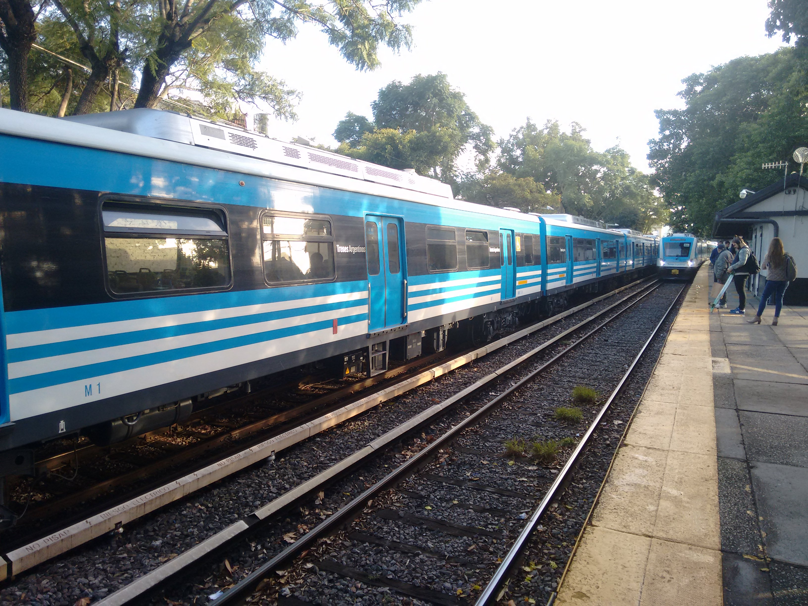

.. header:: Travel modes in Olivos Roche

.. footer:: Page X / Y

.. section-numbering::
   :depth: 3

============================
Travel modes in Olivos Roche
============================

-------------------------------------------------------------------
Travel modes for disadvantaged people in Olivos Roche, Buenos Aires
-------------------------------------------------------------------

.. raw:: pdf

   PageBreak

.. contents:: Index
   :local:
   :depth: 2

.. raw:: pdf

   PageBreak

..
    ## Type of choices in the transportation area
    
    * What's available
    
    
    ## Consider specific stakeholders who have transportation disadvantages
    
    * How the options available in the area serves their needs
    
    
    ## What is laking?
    
    * Recommendations

Olivos Roche
============

..
    http://openptmap.org/?zoom=14&lat=-34.52119&lon=-58.48788&layers=B0000TFT
    https://www.openstreetmap.org/relation/1270158#map=14/-34.5185/-58.5111&layers=T

    http://opencyclemap.org/?zoom=15&lat=-34.52226&lon=-58.49608&layers=B0000
    https://www.openstreetmap.org/relation/1270158#map=14/-34.5185/-58.5111&layers=C

    https://es.wikipedia.org/wiki/Olivos

    * ~97 inh/ha
    * 75 mil hab
    * Area 	7.7 km²

Olivos Roche is an inofficial district of Olivos, part of the community Vicente Lopez, Greater Buenos Aires.
It is bounded by the highway Panamericana (Acceso Norte), the avenue Gobernador Manuel Ugarte, the avenue Antonio Malaver and the avenue Maipu.

.. list-table::
   :class: table-borderless

   * - .. figure:: maps/map-south-america-2.jpg
          :width: 100%

          Autonomous City Buenos Aires, Capital of Argentina [OSM]_

     - .. figure:: maps/map-buenos-aires-2.jpg
          :width: 100%

          Vicente Lopez, Greater Buenos Aires, Argentina [OSM]_
          
          .. openstreetmap.org/relation/1224657

.. figure:: maps/map-olivos-roche.jpg
   :width: 100%

   Olivos Roche, part of Olivos, district of Vicente Lopez, Greater Buenos Aires [OSM]_

Olivos Roche has a size of around 120 blocks and 10'000 inhabitants. It's density reaches almost 100 people per hectare.

Walking
-------

All blocks count with paved sidewalks. A part of the street corners also have curb ramps. As the sidewalk is responsibility of the property owners, the are of different size, surface and quality.

Cycling
-------

There are no bicycle lanes or paths in Olivos Roche. The avenues count with heavy traffic and are not comfortable to ride. Local streets count with speed bumps every blocks.

Scooter
-------

Public transport
----------------

Olivos Roche counts with one railway line, a BRT line, express bus lines and several local bus lines:

Rail
~~~~

Bus
~~~

Express lines
~~~~~~~~~~~~~

BRT
~~~

Schedules
~~~~~~~~~

Taxi and Radio Taxi
-------------------

Uber and Cabify
---------------

Accessibility
-------------

Level of Service
================

Improvement recommendations
===========================

