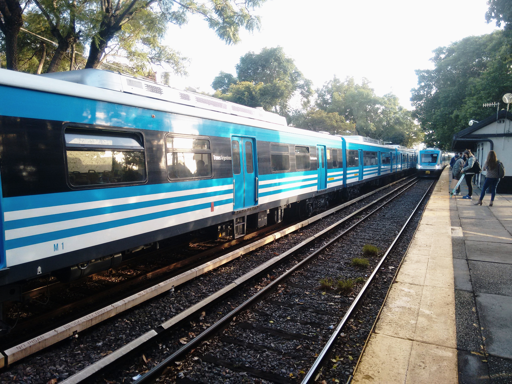
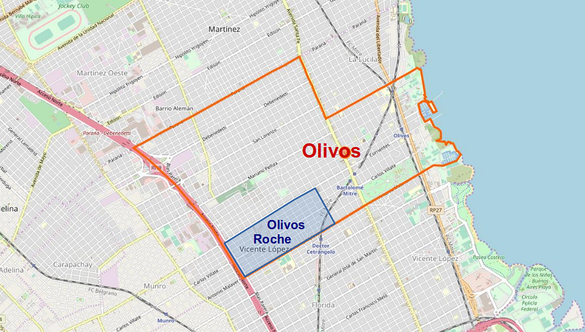
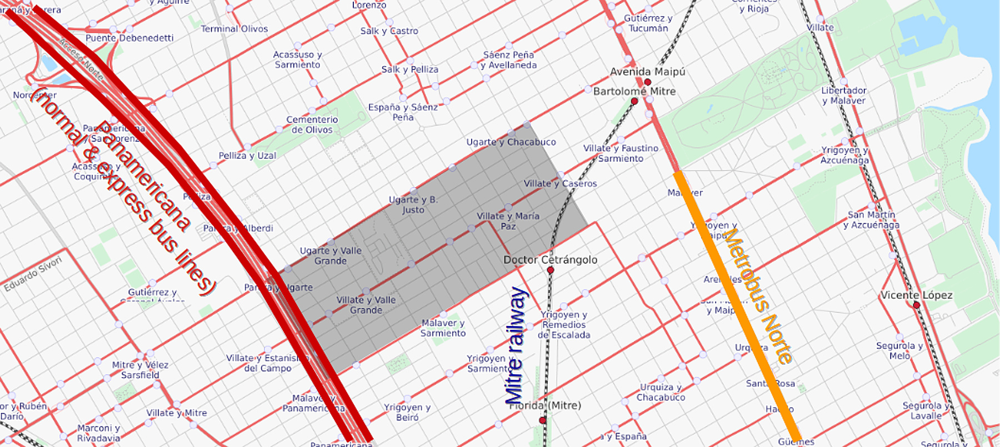
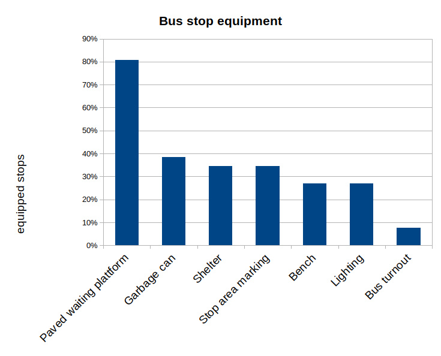
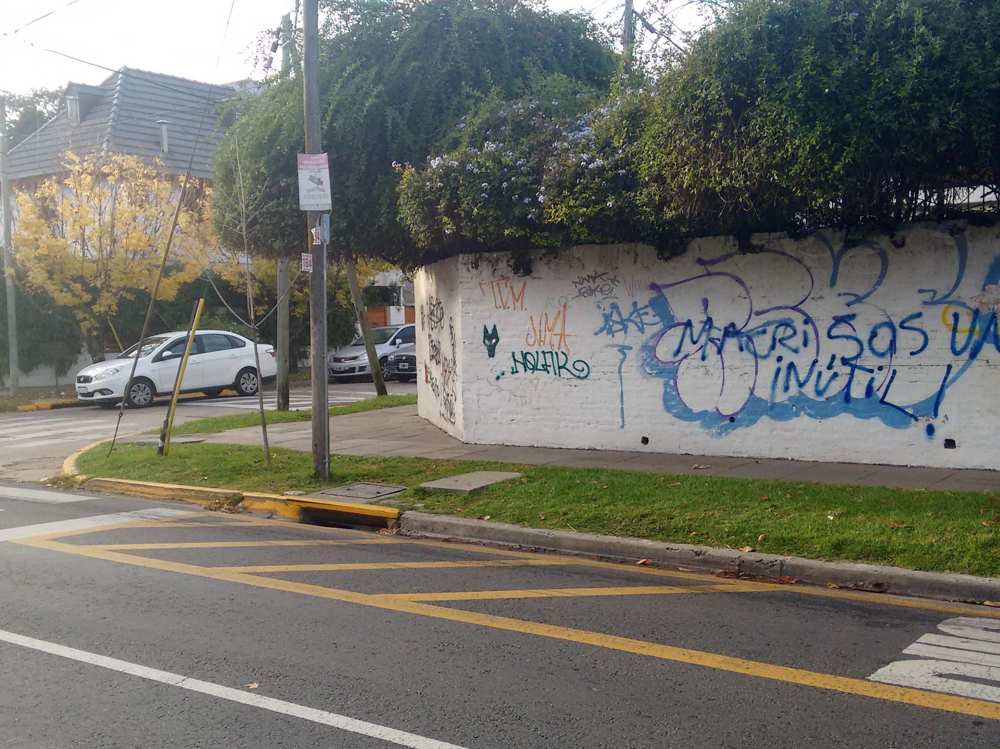
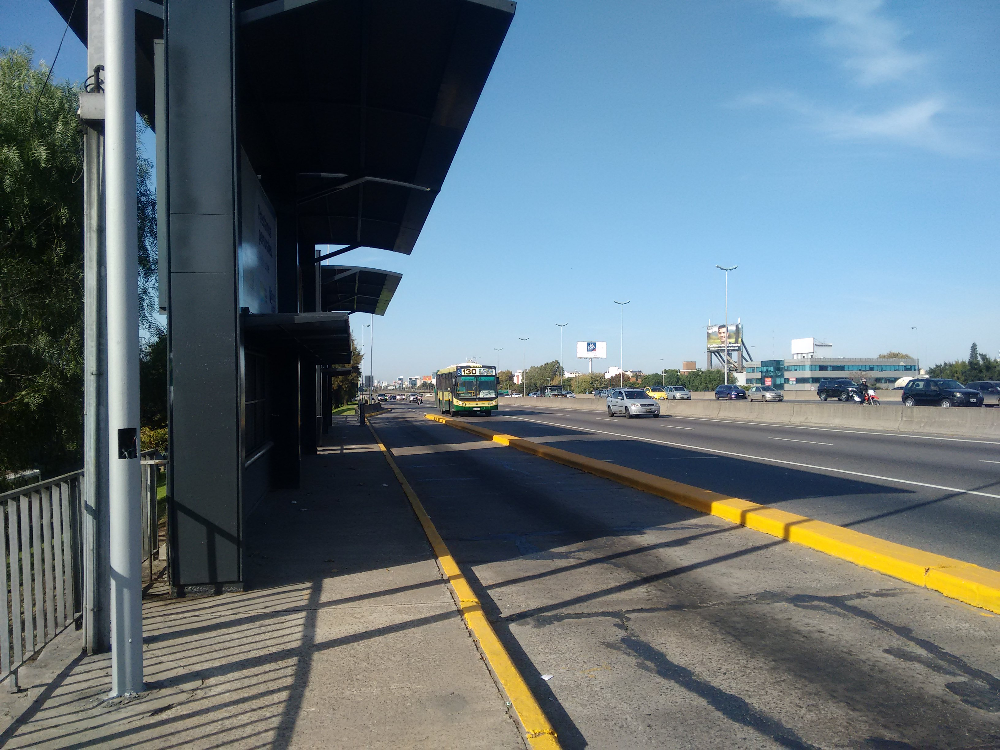

.. header:: Travel modes in Olivos Roche

.. footer:: Page ###Page### / ###Total###

.. section-numbering::
   :depth: 3

Travel modes in Olivos Roche

Travel modes for disadvantaged people in Olivos Roche, Buenos Aires

.. raw:: pdf

   PageBreak oneColumn

.. contents:: Index
   :local:
   :depth: 2

.. raw:: pdf

   PageBreak

..
    ## Type of choices in the transportation area
    
    * What's available
    
    
    ## Consider specific stakeholders who have transportation disadvantages
    
    * How the options available in the area serves their needs
    
    
    ## What is laking?
    
    * Recommendations

Olivos Roche
============

..
    http://openptmap.org/?zoom=14&lat=-34.52119&lon=-58.48788&layers=B0000TFT
    https://www.openstreetmap.org/relation/1270158#map=14/-34.5185/-58.5111&layers=T

    http://opencyclemap.org/?zoom=15&lat=-34.52226&lon=-58.49608&layers=B0000
    https://www.openstreetmap.org/relation/1270158#map=14/-34.5185/-58.5111&layers=C

Olivos Roche is an inofficial district of Olivos, part of the community Vicente Lopez, Greater Buenos Aires.
It is bounded by the highway Panamericana (Acceso Norte), the avenue Gobernador Manuel Ugarte, the avenue Antonio Malaver and the avenue Maipu.

.. list-table::
   :class: table-borderless

   * - .. figure:: maps/map-south-america-2.jpg
          :width: 100%

          Autonomous City Buenos Aires, Capital of Argentina, South America (OpenStreetMap_, 2019, `1224652 <https://www.openstreetmap.org/relation/1224652#map=3/-35.96/-30.85>`_)

     - .. figure:: maps/map-buenos-aires-2.jpg
          :width: 100%

          Vicente Lopez, Greater Buenos Aires, Argentina (OpenStreetMap_, 2019, `-34.7427/-58.5201 <https://www.openstreetmap.org/#map=9/-34.7427/-58.5201>`_)
          
          .. openstreetmap.org/relation/1224657

   Olivos Roche, part of Olivos, district of Vicente Lopez, Greater Buenos Aires (OpenStreetMap_, 2019, `1270158 <https://www.openstreetmap.org/relation/1270158>`_)

Olivos Roche has a size of around 100 blocks and almost 10'000 inhabitants. It's density might be around 90 people per hectare.

Walking
-------

All blocks count with paved sidewalks. A part of the street corners also have curb ramps. As the sidewalk is responsibility of the property owners, the are of different size, surface and quality.

.. list-table::
   :class: table-borderless

   * - .. figure:: images/IMG_20190517_085325-2.jpg
          :width: 100%

          Well maintained sidewalk at Virrey Olaguer y Feliú St. / Cerro de Pasco St.

     - .. figure:: images/IMG_20190508_085407.jpg
          :width: 100%

          Not maintained sidewalk at General José María Paz St. / Antonio Malaver St.

   * - .. figure:: images/IMG_20190516_084528-2.jpg
          :width: 100%

          Curb ramps at Antonio Malaver St. / Ignacio Warnes St.

     - .. figure:: images/IMG_20190508_085213-2.jpg
          :width: 100%

          Sidewalk parking at España St. / Buenos Aires St.

   * - .. figure:: images/IMG_20190507_201004-2.jpg
          :width: 100%

          Street lighting at the corner Antonio Malaver St. / Ignacio Warnes St., looking in direction of Panamericana.

     - .. figure:: images/IMG_20190507_201029-2.jpg
          :width: 100%

          Sidewalk behind tree row at the corner Antonio Malaver St. / Ignacio Warnes St., looking in direction of the avenue Maipú.

All streets have street lighting and tree rows. This makes the sidewalk quite dark at some places.

Cycling
-------

There are no bicycle lanes or paths in Olivos Roche. The avenues count with heavy traffic and are not comfortable to ride. Local streets count with speed bumps every blocks.

.. list-table::
   :class: table-borderless

   * 
     - .. figure:: images/IMG_20190520_075106-malaver.jpg
          :width: 100%

          Antonio Malaver St. congested in the morning (1.75 driving lanes, 0.75 parking lanes)

     - .. figure:: images/IMG_20190518_114849-bicycle-rack.jpg
          :width: 100%

          Bicycle rack in front of a backery in Carlos Villate St.

   * - .. figure:: images/IMG_20190518_105453-normal-speed-bump.jpg
          :width: 100%

          Normal speed bump at Olaguer y Feliú St. / Villate Grande St.

     - .. figure:: images/IMG_20190517_085018-speed-humps.jpg
          :width: 100%

          Speed humps at Olaguer y Feliú St. / Juan B. Justo St.

* Bicycle can be taken on the train.
* Congestion on avenues (no bicycle lanes).
* Speed humps are a problem for bicycles

Scooter
-------

Electric scooter networks did not yet arrive to Olivos.
They arrived in Buenos Aires in March this year (LaNacion_, 2019), but have not been seen yet in the streets.
Sidewalks end at every block and are mostly narrow and in many places broken. Not all corners count with curb ramps. So it's questionable, if scooters will be successful in Olivos, respectively in Buenos Aires in general.

Public transport
----------------

Olivos Roche counts with one railway line, a BRT line, express bus lines and several local bus lines:

   Metrobus Norte (BRT line north), Mitre commuter rail and Panamericana express buses (OpenStreetMap_, 2019, `-34.5159/-58.5107 <https://www.openstreetmap.org/#map=14/-34.5159/-58.5107&layers=T>`_)

Local transit
~~~~~~~~~~~~~

Bus
...

The common bus lines are mostly driving on the big and small avenues, some also pass through local streets.
Most of the stops do not have a shelter or a an extra stop sign. Often there is only a small sign at a near tree or light pole.
Some stops count with garbage bins. Almost no stop has lighting and lighted advertising panels did not arrive yet to Olivos. 
Also the stops also do not count with any information about the route or the service frequencies.s

.. list-table::
   :header-rows: 1

   * - Gobernador Manuel Ugarte St.
     - Carlos Villate St.
     - Antonio Malaver St.
   * - lines 333 and 434 from Panamericana in direction of Avenue Maipu
     - lines 333 and 434 from Maipu in direction of Panamericana
     - 
   * -
     - line 184 from station Dr. Cetrangolo / south-east in direction Panamericana
     - line 184 from Panamericana in direction station Dr. Cetrangolo / south-east

.. list-table::
   :class: table-borderless

   * - .. figure:: images/IMG_20190505_140108.jpg
          :width: 100%

          Bus line 184 stopping at Antonio Malaver St. / Valle Grande St.

     - .. figure:: images/IMG_20190503_084944.jpg
          :width: 100%

          Bus stop at Antonio Malaver St. / General José María Paz St.

   * - .. figure:: images/IMG_20190516_084727.jpg
          :width: 100%

          Bus shelter at Antonio Malaver St. / Fray Justo Sarmiento St.

     - .. figure:: images/IMG_20190517_192749-2.jpg
          :width: 100%

          Bus shelter at night at Antonio Malaver St. / Fray Justo Sarmiento St.

   Bus stop equipments for all 24 stops in Olivos Roche

   Poor bus stop at Antonio Malaver St. / Juan B. Justo St. (Plattform not paved, no shelter, grafity at the wall, no garbage bin, minimal stop sign)

Regional transit
~~~~~~~~~~~~~~~~

Mitre Rail
..........

The commuter rail Mirte connects the station Bartolomé Mitre with the main station Retiro in the city center. Near Olivos Roche it also stops at the station Dr. Cetrangolo.
At the terminal station Bartolomé Mitre, a pedestrian bridge connects to the Terminal station of the Tren de la costa on the other side of the road, which takes passengers to Tigre in the north of Greater Buenos Aires.

   Mitre commuter rail stopping in Dr. Cetrangolo

* Frequencies: 3 Trains per hour
* Capacity: ? Seats + ? Standing
* Accessibility: On-grade

Panamericana bus & express lines
................................

There are several express lines on the Panamericana highway, which do not stop at all the stops and connect the passengers to the city and the north of Greater Buenos Aires.

.. list-table::
   :header-rows: 1

   * - Common bus lines
     - Express bus lines
   * - 60, 15, 130, 194, 15, 21, 71, 57, 203, 365
     - 60 rapido (stops only in Ugarte), 15 semi rapido, 194

..
   https://www.xcolectivo.com.ar/colectivo/recorridos.php?linea=60

   Panamericana Highway bus stop (Panamericana / Antonio Malaver)

BRT
...

On Maipu there is a Metrobus line (So is BRT called in Argentina) beginning at the corner Malaver/Maipu, heading to Plaza Italia in the city of Buenos Aires). Several bus lines serve them (152, 19, 203, 21, 59, 168, 71).

.. figure:: https://www.buenosaires.gob.ar/sites/gcaba/files/styles/interna_pagina/public/_mg_2051.jpg?itok=XoeMO1cm
   :width: 50%

   Bus 152 arriving at the Metrobus stop Deheza (source: https://www.buenosaires.gob.ar/movilidad/metrobus/metrobus-norte)

Schedules & frequencies
~~~~~~~~~~~~~~~~~~~~~~~

Taxi and Radio Taxi
-------------------

There are several taxi companies in Olivos Roche. In front of the terminal station Mitre there is a public taxi stop.

Uber and Cabify
---------------

Accessibility
-------------

BRT
~~~

Source: https://www.buenosaires.gob.ar/movilidad/metrobus/metrobus-norte

.. list-table::
   :class: table-borderless

   * - .. figure:: https://www.buenosaires.gob.ar/sites/gcaba/files/styles/interna_pagina/public/_mg_1551.jpg
          :width: 100%

          Metrobus at-grade boarding

     - .. figure:: https://www.buenosaires.gob.ar/sites/gcaba/files/styles/interna_pagina/public/_mg_2045.jpg
          :width: 100%

          Tactile paving

Level of Service
================

Walking
-------

In general, walking is comfortable and feasable in Olivos Roche, due to the all over existing paved sidewalks.

The grid system makes it easy no navigate and calculate distances, but causes 30% longer walking distances than a grid system with diagonal streets.

Pedestrians always need to be attendant, where they put their feet, due to the changing sidewalk sizes, surface types, broken parts, wholes or animal dung.

Walking with heavy or huge bags or caddy may be complicated, due to missing curb ramps or broken sidewalks.

During the day people feel safe and walk much. In the night, dark sidewalks sections, caused by big trees, covering street lighting, not maintained or littered sidewalks, make people feel unsafe at some places. Also there is not much activity on most of the streets, as there are not so many shops and most of them are concentrated around Carlos Villate and Gobernador Manuel Ugarte.

Improvement recommendations
===========================

Low cost projects
-----------------

Projects with low cost but high impact, which could be implemented quickly.

* Traffic law enforcement (sidewalk maintenance and size, tree size and clearance, street parking, velocity, ...)
* Replacement of transit frequencies by schedules, publish transit schedules at stops and online
* Bicycle lanes, load and onload zones, ... (Paint only)
* Move (shelterless) bus stops for better multi-modal connections
* Prioritized traffic lights for transit
* Prioritize road maintenance for transit corridors

Medium cost projects
--------------------

* Enhance street lighting and lightened advertisements for more security
* More cafes and shops around the plazas
* Corner enhancements for transit turning corners
* Replace at-grade rain water sewer at crossings by underground sewer
* Street furniture
* On-street bicycle parking

High cost projects
------------------

Projects that require long term funds and planning and are costly to implement.

* Urban villages (local centers with shops, restaurants, corner stores, street cafes, parks, street furniture, etc) so people had more opportunities in walking distance.
* Monitored bicycle parkings at railway stations and important bus stops
* Replace traffic lights by bus-friendly roundabouts
* Transit centers Cetrangolo, Mitre and Panamericana
* Rail extension
* Separated Bicycle lanes
* Local road corner enhancements

.. rubric:: References

.. [OpenStreetMap] OpenStreetMap Fundation. (2019). Retrieved May 10, 2019 from `www.openstreetmap.org <http://www.openstreetmap.org>`_
.. [LaNacion] La Nacion Newspaper. (2019, March 21). Los monopatines eléctricos llegan a Buenos Aires. Retrieved May 10, 2019 from `www.lanacion.com.ar/economia/la-bici-ya-fueel-monopatin-electrico-se-extiende -y-prepara-su-desembarco-local133x143-mm-nid2230136 <https://www.lanacion.com.ar/economia/la-bici-ya-fueel-monopatin-electrico-se-extiende-y-prepara-su-desembarco-local133x143-mm-nid2230136>`_

.. http://docutils.sourceforge.net/docs/ref/rst/directives.html
.. https://docs.anaconda.com/restructuredtext/detailed/
.. https://stackoverflow.com/questions/4550021/working-example-of-floating-image-in-restructured-text
.. https://student.unsw.edu.au/citing-images-and-tables-found-online
.. https://build-me-the-docs-please.readthedocs.io/en/latest/Using_Sphinx/UsingBibTeXCitationsInSphinx.html
.. https://www.google.com/url?q=http://rst2pdf.ralsina.me/handbook.html&sa=U&ved=2ahUKEwjYv5O0xp3iAhWNIbkGHTHfDsQQFjACegQICRAB&usg=AOvVaw0pmyqM_GAJ3grRMEAvyFkn
.. https://www.google.com/url?q=http://docutils.sourceforge.net/docs/ref/rst/directives.html&sa=U&ved=2ahUKEwjYv5O0xp3iAhWNIbkGHTHfDsQQFjAAegQIARAB&usg=AOvVaw3TLIs5t0HK3e8xvA7hjJJH
.. http://rst2pdf.ralsina.me/stories/quickref.html
.. Citation:
.. https://libguides.bc.edu/c.php?g=44057&p=279820
.. https://pitt.libguides.com/citationhelp
.. https://pitt.libguides.com/c.php?g=12108&p=64730
.. https://guides.libraries.psu.edu/apaquickguide/intext

