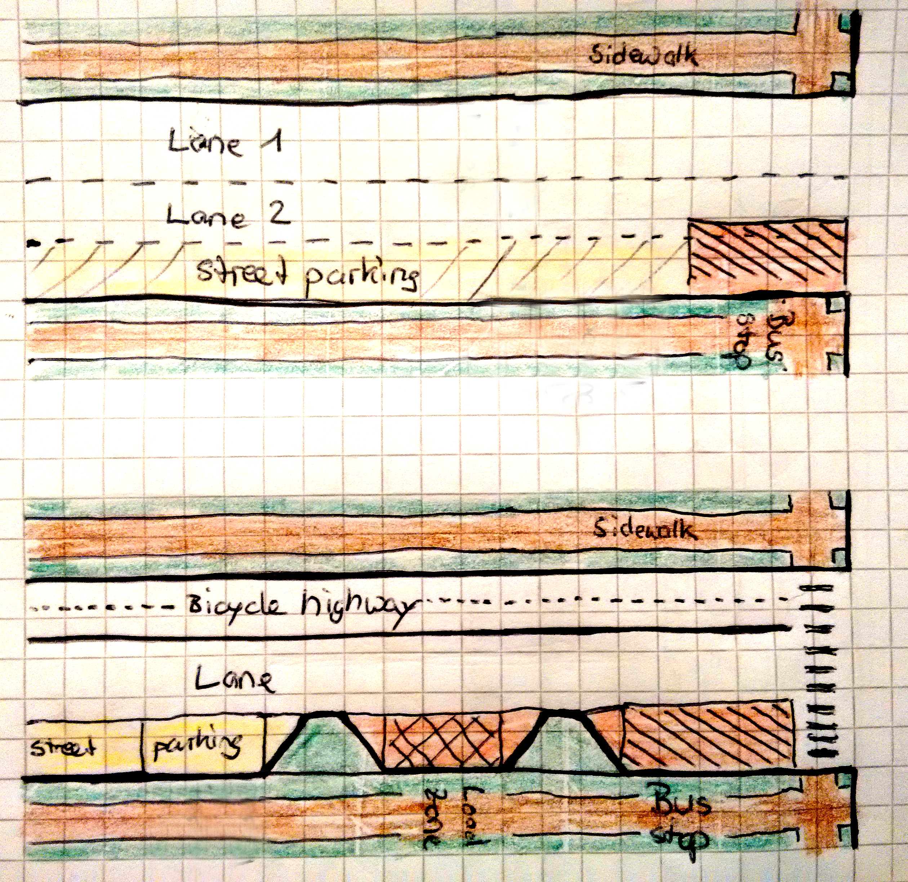

.. header:: Travel modes in Olivos Roche

.. footer:: Page ###Page### / ###Total###

.. section-numbering::
   :depth: 3

|
|

.. container:: document-title

   Olivos Roche | Travel modes

|

.. image:: images/cover.jpg
   :width: 100%
   :align: center

|

.. container:: document-subtitle

   Travel modes for disadvantaged people in Olivos Roche, Buenos Aires

|

.. class:: center
   
   Tobias Blaser

   

.. raw:: pdf

   PageBreak oneColumn

.. contents:: Index
   :local:
   :depth: 2

.. raw:: pdf

   PageBreak

..
    ## Type of choices in the transportation area
    
    * What's available
    
    
    ## Consider specific stakeholders who have transportation disadvantages
    
    * How the options available in the area serves their needs
    
    
    ## What is laking?
    
    * Recommendations

Olivos Roche
============

..
    http://openptmap.org/?zoom=14&lat=-34.52119&lon=-58.48788&layers=B0000TFT
    https://www.openstreetmap.org/relation/1270158#map=14/-34.5185/-58.5111&layers=T

    http://opencyclemap.org/?zoom=15&lat=-34.52226&lon=-58.49608&layers=B0000
    https://www.openstreetmap.org/relation/1270158#map=14/-34.5185/-58.5111&layers=C

Olivos Roche is an inofficial district of Olivos, part of the community Vicente Lopez, Greater Buenos Aires.
It is bounded by the highway Panamericana (Acceso Norte), the avenue Gobernador Manuel Ugarte, the avenue Antonio Malaver and the avenue Maipu.

.. list-table::
   :class: table-borderless

   * - .. figure:: maps/map-south-america-2.jpg
          :width: 100%

          Autonomous City Buenos Aires, Capital of Argentina, South America (OSM2019_, 2019, `1224652 <https://www.openstreetmap.org/relation/1224652#map=3/-35.96/-30.85>`_)

     - .. figure:: maps/map-buenos-aires-2.jpg
          :width: 100%

          Vicente Lopez, Greater Buenos Aires, Argentina (OSM2019_, 2019, `-34.7427/-58.5201 <https://www.openstreetmap.org/#map=9/-34.7427/-58.5201>`_)
          
          .. openstreetmap.org/relation/1224657

.. figure:: maps/map-olivos-roche.jpg
   :width: 100%

   Olivos Roche, part of Olivos, district of Vicente Lopez, Greater Buenos Aires (OSM2019_, 2019, `1270158 <https://www.openstreetmap.org/relation/1270158>`_)

Olivos Roche has a size of around 100 blocks and almost 10'000 inhabitants. It's density might be around 90 people per hectare.

.. raw:: pdf

   PageBreak

Walking
-------

The streets and avenues are following a grid system. Most blocks are around 100m long.
All blocks count with paved sidewalks. A part of the street corners also have curb ramps. As the sidewalk is responsibility of the property owners, the are of different size, surface and quality. Pedestrian crossings on avenues mostely count with curb ramps.

.. list-table::
   :class: table-borderless

   * - .. figure:: images/IMG_20190517_085325-2.jpg
          :width: 100%

          Well maintained sidewalk at Virrey Olaguer y Feliú St. / Cerro de Pasco St.

     - .. figure:: images/IMG_20190508_085407.jpg
          :width: 100%

          Not maintained sidewalk at General José María Paz St. / Antonio Malaver St.

   * - .. figure:: images/IMG_20190516_084528-2.jpg
          :width: 100%

          Curb ramps at Antonio Malaver St. / Ignacio Warnes St.

     - .. figure:: images/IMG_20190508_085213-2.jpg
          :width: 100%

          Sidewalk parking at España St. / Buenos Aires St.

Pedestrians always need to be attendant, where they put their feet, due to the changing sidewalk sizes, surface types, broken parts, wholes or animal dung.

All streets have street lighting and tree rows. In general, the streets are well lighted. But at some places, the tree rows make the sidewalk quite dark, as the cover the street lamps.

.. list-table::
   :class: table-borderless

   * - .. figure:: images/IMG_20190507_201004-2.jpg
          :width: 100%

          Street lighting at the corner Antonio Malaver St. / Ignacio Warnes St., looking in direction of Panamericana.

     - .. figure:: images/IMG_20190507_201029-2.jpg
          :width: 100%

          Sidewalk behind tree row at the corner Antonio Malaver St. / Ignacio Warnes St., looking in direction of the avenue Maipú.

There is not much activity on most of the streets, especially at early and late hours, as there are not so many shops and most of them are concentrated around Carlos Villate and Gobernador Manuel Ugarte.

Cycling
-------

Olivos Roche does not yet count with public bicycle infrastructure.
There are no bicycle lanes or paths, cyclists use the streets shared with cars. The avenues count with heavy traffic and are not comfortable to ride. 

.. list-table::
   :class: table-borderless

   * 
     - .. figure:: images/IMG_20190520_075106-malaver.jpg
          :width: 100%

          Antonio Malaver St. congested in the morning (1.75 driving lanes, 0.75 parking lanes)

     - .. figure:: images/IMG_20190518_114849-bicycle-rack.jpg
          :width: 100%

          Bicycle rack in front of a backery in Carlos Villate St.

   * - .. figure:: images/IMG_20190518_105453-normal-speed-bump.jpg
          :width: 100%

          Normal speed bump at Olaguer y Feliú St. / Villate Grande St.

     - .. figure:: images/IMG_20190517_085018-speed-humps.jpg
          :width: 100%

          Speed humps at Olaguer y Feliú St. / Juan B. Justo St.

Some avenues do not have sufficient wide lanes (e.g. 1 lane + 0.75 lane + 0.75 parking lane). This makes it dangerous to drive between the driving cars and parked cars.
As some avenues are congested in peek hours, its even more difficult to drive a bicycle on them.

Local streets on the other side, count with speed bumps every blocks and are interrupted at some places by the railway lanes.
In the last years installed speed humps are quite dangerous for bicycles, as they need to be crossed diagonal.

In the morning or evening, bicycling may also be a security problem, as it happens from time to time, that bicyclists are assaulted.

There are no bicycle parking or monitored bicycle stations. Parking bicycles on the street for a longer time is not feasable, as they got stolen.

Bicycles can be taken on the train. The first and last coach contain bicycle racks to store them safely.
On the bus it's not allowed to carry the bicycle.

Scooters
--------

Electric scooter networks did not yet arrive to Olivos.
They arrived in Buenos Aires in March this year (LN2019_, 2019), but have not been seen yet in the streets.
Sidewalks end at every block and are mostly narrow and in many places broken. Not all corners count with curb ramps. So it's questionable, if scooters will be successful in Olivos, respectively in Buenos Aires in general.

Public transport
----------------

Olivos Roche counts with one railway line, a BRT line, express bus lines and several local bus lines:

.. figure:: maps/map-transit-lines.jpg
   :width: 100%

   Metrobus Norte (BRT line north), Mitre commuter rail and Panamericana express buses (OSM2019_, 2019, `-34.5159/-58.5107 <https://www.openstreetmap.org/#map=14/-34.5159/-58.5107&layers=T>`_)

Local transit
~~~~~~~~~~~~~

Bus
...

The common bus lines are mostly driving on the big and small avenues, some also pass through local streets.
Most of the stops do not have a shelter or a an extra stop sign. Often there is only a small sign at a near tree or light pole.
Some stops count with garbage bins. Almost no stop has lighting and lighted advertising panels did not arrive yet to Olivos. But some stops are well lighted by street lamps.
Also the stops also do not count with any information about the route or the service frequencies.

.. list-table::
   :header-rows: 1

   * - Gobernador Manuel Ugarte St.
     - Carlos Villate St.
     - Antonio Malaver St.
   * - * lines 333 and 434 from Panamericana in direction of Avenue Maipu
     - * lines 333 and 434 from Maipu in direction of Panamericana
       * line 184 from station Dr. Cetrangolo / south-east in direction Panamericana
     - * line 184 from Panamericana in direction station Dr. Cetrangolo / south-east

.. list-table::
   :class: table-borderless

   * - .. figure:: images/IMG_20190505_140108.jpg
          :width: 100%

          Bus line 184 stopping at Antonio Malaver St. / Valle Grande St.

     - .. figure:: images/IMG_20190503_084944.jpg
          :width: 100%

          Bus stop at Antonio Malaver St. / General José María Paz St.
   
   * - .. figure:: images/IMG_20190516_084727.jpg
          :width: 100%

          Bus shelter at Antonio Malaver St. / Fray Justo Sarmiento St.

     - .. figure:: images/IMG_20190517_192749-2.jpg
          :width: 100%

          Bus shelter at night at Antonio Malaver St. / Fray Justo Sarmiento St.

   * - .. figure:: images/bus-stop-equipment.jpg
          :width: 100%

          Bus stop equipments for all stops in Olivos Roche (local & express way)

     - .. figure:: images/IMG_20190516_084953-poor-bus-stop.jpg
          :width: 100%

          Poor bus stop at Antonio Malaver St. / Juan B. Justo St. (Plattform not paved, no shelter, grafity at the wall, no garbage bin, minimal stop sign)

Regional transit
~~~~~~~~~~~~~~~~

Mitre Rail
..........

The commuter rail Mirte connects the station Bartolomé Mitre with the main station Retiro in the city center. Near Olivos Roche it also stops at the station Dr. Cetrangolo.
At the terminal station Bartolomé Mitre, a pedestrian bridge connects to the Terminal station of the Tren de la costa on the other side of the road, which takes passengers to Tigre in the north of Greater Buenos Aires.

.. list-table::
   :class: table-borderless

   * - .. figure:: images/IMG_20190508_090101.jpg
          :width: 100%

          Mitre commuter rail stopping in Dr. Cetrangolo

     - .. figure:: images/IMG_20180430_103155.jpg
          :width: 100%

          Mitre commuter rail train interier

* Type: CSR (Unidad eléctrica múltiple CSR), 132m longitud
* Frequencies: 3 Trains per hour, ~33 services / day and direction
* Capacity: 408 seats
* Accessibility: On-grade

Panamericana bus & express lines
................................

There are several express lines on the Panamericana highway, which do not stop at all the stops and connect the passengers to the city and the north of Greater Buenos Aires.

.. list-table::
   :header-rows: 1

   * - Common bus lines
     - Express bus lines (stop only in Ugarte)
   * - * 365
       * 203
       * 130
       * 71
       * 60
       * 57
       * 21
       * 15
     - * 194
       * 60 semi rápido
       * 21 semi rápido
       * 15 semi rápido

..
   https://www.xcolectivo.com.ar/colectivo/recorridos.php?linea=60

BRT
...

On Maipu Avenue, there is a Metrobus line (So is BRT called in Argentina), beginning at the corner Malaver/Maipu, heading to Plaza Italia in the city of Buenos Aires). Several bus lines serve them (152, 19, 203, 21, 59, 168, 71).

.. list-table::
   :class: table-borderless

   * - .. figure:: images/IMG_20190518_110555.jpg
          :width: 100%

          Panamericana Highway bus stop (Panamericana / Antonio Malaver)

     - .. figure:: https://www.buenosaires.gob.ar/sites/gcaba/files/styles/interna_pagina/public/_mg_2051.jpg?itok=XoeMO1cm
          :width: 100%

          Bus 152 arriving at the Metrobus stop Deheza (BAC2019_, 2019)

   * - .. figure:: https://www.buenosaires.gob.ar/sites/gcaba/files/styles/interna_pagina/public/_mg_1551.jpg
          :width: 100%

          Metrobus at-grade boarding (BAC2019_, 2019)

     - .. figure:: https://www.buenosaires.gob.ar/sites/gcaba/files/styles/interna_pagina/public/_mg_2045.jpg
          :width: 100%

          Tactile paving at Metrobus stations (BAC2019_, 2019)

Frequencies
~~~~~~~~~~~

All buslines (common & express) have frequencies between 6 and one services per hour. But often buses get delayed by rail barriers, congestion or amiss parked cars. So it may happen, that people need to wait 20 minutes and then two buses arrive in tandem.

Fares
~~~~~

In general, public transport is cheap in Buenos Aires, compared to other services. Prices raise stagged by the distance, but the first stage is quite long. Currently (26/05/19) the prices for the first stage are as follows:

.. list-table::   
   :header-rows: 1

   * -
     - Price (ARS)
     - Price (USD by 26/05/19)
   * - Mitre railway
     - $18
     - U$S 0.40
   * - Bus
     - $12.25
     - U$S 0.25
   * - Express bus (+25%)
     - $22.5
     - U$S 0.50
   * - Express bus on highway (+75%)
     - $31.5
     - U$S 0.70
     
The median income in Argentina was ARS $16'293 per month (~USD $468.-) for the first term 2018 (PN2018_, 2018), what is about 10% of the median income for the United States and 9% for Switzerland (GPD2018_, 2018) at the same time. Compared to Switzerland, the fares in Buenos Aires are still more then 50% cheaper, in relation to the salary.

Taxi, Radio Taxi, Uber and Cabify
---------------------------------

There are several taxi companies in Olivos Roche. In front of the terminal station Mitre there is a public taxi stand, but Dr. Cetrangolo station is too small, to count with a taxi stand.

.. list-table::
   :header-rows: 1
   :widths: 10 45 45

   * -
     - .. image:: images/icon-plus.png
          :width: 0.75cm
          :target: AHI2019_
     - .. image:: images/icon-negative.png
          :width: 0.75cm
          :target: AHI2019_
   * - Taxi / Radio taxi
     - * Taxi: Available at stations and taxi stands
       * Radio Taxi: Better availability than taxis
     - * Expensive, in comparison transit
       * Support only payment by cash
       * Vehicles not always well maintained
       * Strange / agressive driving Behavior
   * - Uber
     - * Cheaper than taxis
       * High availability 
     - * Trust in private drivers needed
   * - Cabify
     - * Professional drivers
       * Cheaper than taxi
     - * More expensive than Uber

Uber, Lyft and Cabify are highly available and used. Cabify counts with professional drivers and has agreements with companies for corporal rides of employees.

.. raw:: pdf

   PageBreak

Level of Service
================

Walking
-------

.. list-table::
   :header-rows: 1

   * - .. image:: images/icon-smile-face.png
          :width: 0.75cm
          :target: RI2019_
     - .. image:: images/icon-sad-face.png
          :width: 0.75cm
          :target: RI2019_
   * - * Extensive sidewalk network
       * Grid system, short access
       * Curb ramps on avenues
       * Well lighting
       * Green spaces (trees and grassed areas)
     - * Broken(not maintained sidewalks
       * Littered sidewalks
       * Missing curb ramps on local streets
       * Dark sidewalk sections
       * Few activity on the streets in the evening
       * No benches/street furniture to rest and stay

In general, walking is well accessible and safe in Olivos Roche, due to the all over existing paved sidewalks.

The grid system makes it easy no navigate and calculate distances, but causes 30% longer walking distances than a grid system with diagonal streets.

Walking with heavy or huge bags, buggy or caddy may be complicated, due to missing curb ramps or broken sidewalks. People walking a lot with buggies buy models with bigger wheels, but this models often are not completely foldable to carry by car or bus.

During the day people feel safe and walk much. In the night, dark sidewalks sections, caused by big trees, and not maintained or littered sidewalks, make people feel unsafe at some places. Missing activites on many roads contribute to that sense.

.. figure:: images/Alfonzo-2005-Hierarchy-of-walking-needs.jpg
   :width: 75%

   Hierarchy of Walking needs within a Social-Ecological Framework (AM2005_, 2005, p. 820)

Looking Alfonzos Walking needs classification (Alfozo, 2005), we can say, the basic needs Accessibility and Safety are satisfied at a high level in Olivos Roche, but there is room for improvement for comfortable and pleasurable Walking. 

Cycling
-------

.. list-table::
   :header-rows: 1

   * - .. image:: images/icon-smile-face.png
          :width: 0.75cm
          :target: RI2019_
     - .. image:: images/icon-sad-face.png
          :width: 0.75cm
          :target: RI2019_
   * - * Local streets allow secure cycling
       * Bicycle rack on the train
     - * Dangerous speed humps
       * Cycling on avenues and in the night is dangerous
       * No bicycle lanes/paths or parkings
       * No monitored bicycle stations

The bicycle infrastructure in Olivos, Roche does clearly not satisfy the cyclists needs. They are more or less ignored by the municipality, the focus lays completely on car traffic and walking. The only existing bicycle infrastructure are the bicycle racks on the train.

Scooters
--------

As scooters did not yet arrive to Olivos, there is not yet any thought about their integration into the public space and traffic flows.
Most critiques for walking and cycling also apply for scooters. There is not infrastructure, where you can ride it and you can't ride it on the sidewalks.

Public transport
----------------

.. list-table::
   :header-rows: 1

   * - .. image:: images/icon-smile-face.png
          :width: 0.75cm
          :target: RI2019_
     - .. image:: images/icon-sad-face.png
          :width: 0.75cm
          :target: RI2019_
   * - * Railway, express bus and BRT lines
       * Extensive local bus network
       * High frequencies during the day
     - * Buses and BRT lines have frequencies, no fixed schedules
       * Bus stops are not well maintained
       * Only a few bus stops count with shelter or lighting
       * Crowded in peek hours

The public transport offer is quite well in Olivos Roche, service are available up to late hours in the evening. But in peek hours, trains and buses are crowded.

The unreliable frequencies makes it complicated to plan a multi modal travel and people need to plan with sufficient margen, what makes multi modal travel unattractive, in comparison to car travel.

As the fares are cheap, for many poor people it's the only way to travel, as they can not afford any motorized vehicle.

Taxi, Radio Taxi, Uber and Cabify
---------------------------------

.. list-table::
   :header-rows: 1

   * - .. image:: images/icon-smile-face.png
          :width: 0.75cm
          :target: RI2019_
     - .. image:: images/icon-sad-face.png
          :width: 0.75cm
          :target: RI2019_
   * - * Good availability
       * The only solution to get to some places without a car or late in the evening
     - * Trust in drivers is not always given
       * Not available in the slums

Taxi and TNC services provide a good available service in Olivos Roche, but the drivers not always give the best impression. 

.. raw:: pdf

   PageBreak

Improvement recommendations
===========================

Low cost projects
-----------------

Projects with low cost but high impact, which could be implemented quickly.

* Traffic law enforcement
* Transit schedules
* Spaces for disadvantaged modes (lane marking only)
* Bus stop consolidation
* Prioritized traffic lights
* Prioritize road maintenance for transit corridors
* More commercial activity

Traffic law enforcement
~~~~~~~~~~~~~~~~~~~~~~~

A significant enhancement of the sidewalk quality, walkability and traffic secutiry could be reached, enforcing already existing laws:

* Force property owners to fix their sidewalks, to match standards and laws and maintain them appropiately (sidewalks are at the property owners responsibility).
* Force the municipality to cut the trees to maintain a minimal clearance to prevent trees from covering street lamps (Tree cutting is at the municipalities responsibility, even when the trees are planted by the property owner).
* Stop people from parking on the sidewalk, in driveways and in the second line, to allow pedestrians and bicycles to circulate without obstacles.
* Enforce traffic laws regarding speed, traffic lights parking to increase traffic safety.

Transit schedules
~~~~~~~~~~~~~~~~~

Replace transit frequencies by fixed schedules, implement buffer times and early-turning-points for delayed services, to allow transit users to plan their trips and connections.

Publish schedules at the stops, in the vehicles itself and online, to give users easy access to them. Also publish them in common open-data formats under an open-data license, to allow plattforms and app-developers to integrate this services.

Spaces for disadvantaged modes (lane marking only)
~~~~~~~~~~~~~~~~~~~~~~~~~~~~~~~~~~~~~~~~~~~~~~~~~~

Create bicycle lanes, bicycle boxes, load and onload zones, bus lanes and stopping areas using lane marking.
This allows to create reserved spaces for all modes, without big investments.
Once the new measures proved themselves and the street needs to be maintained anyway, the lane marking can be replaced by traffic islands or new curbs.

Bus stop consolidation
~~~~~~~~~~~~~~~~~~~~~~

Olivos Roche has around 25 local bus stops. Most of them have are 200m away from the next stop, but there are blocks, where stops are located every 100m.
The density of the bus lines allows to put stops every 300m, without causing riders to walk much more. That way, the amount of stops could be reduced by around 30%, what had a positive impact on the average speed of the buses, but also allows to invest more per stop, and maintain them better.
As only a few stops have shelters, moving them is a small investment.

Prioritize road maintenance for transit corridors
~~~~~~~~~~~~~~~~~~~~~~~~~~~~~~~~~~~~~~~~~~~~~~~~~

Prioritize road maintenance for roads with public transport lines, to make rides more comfortable and reduce the maintenance cost on the vehicles, caused by bumpy roads and loose pavement parts.

Prioritized traffic lights
~~~~~~~~~~~~~~~~~~~~~~~~~~

Replace traffic lights, which need to be replaced anyway, by new traffic lights with priority signal support, to recognize buses and create green waves for them. This allows more schedule stability and higher average speed.

More commercial activity
~~~~~~~~~~~~~~~~~~~~~~~~

Adjust regulations to ease the opening of cafes or small shops around transit stops.

Medium cost projects
--------------------

* Better transit stop lighting
* Corner enhancements for transit
* Rain water sewer enhancements
* Street furniture
* On-street bicycle parking
* Bus bicycle racks

Better transit stop lighting
~~~~~~~~~~~~~~~~~~~~~~~~~~~~

Enhance the lighting at transit stop by installing proper lighting, additional street lamps or lighted advertisement panels. There exist already solar panel/battery sets which allow to power the stops with connecting them to the electric network.

This would increase the safety of bus stops and provide revenue from the advertisement panels.

Corner enhancements for transit
~~~~~~~~~~~~~~~~~~~~~~~~~~~~~~~

Adjust corners, where buses are turning, to ease the turn: Raise the curb radius and add barrier areas, to prevent parking close to the corner. Affected corners: España St. / Carlos Villate St. and Carlos Villate St. / Blas Parera St.

This would allow the bus to turn faster, reduce the case, where buses are blocked by parked cars, and enhance the crossing safety.

Rain water sewer enhancements
~~~~~~~~~~~~~~~~~~~~~~~~~~~~~

Rplace at-grade rain water sewer, crossing avenues and transit corridors, by underground sewer. In most of the places, the underground sewer is already there, only an additional drain on both sides of the crossing are needed. Examples: Carlos Villate St. / España St., Carlos Villate St. / Ayacucho St.

This enhancement would increase the bus speed and ride comfort, but also the comfort for cyclists.

Street furniture
~~~~~~~~~~~~~~~~

Street furniture could increase the activity on the streets and raise safety. They also may provide stops to rest for elder or disabled people.

.. list-table::
   :class: table-borderless

   * - .. figure:: images/IMG_20190414_132142.jpg
          :width: 100%

          Attractive street furniture example from Auckland, New Zealand.

     - .. figure:: images/IMG_20190420_100416.jpg
          :width: 100%

          Classic street furniture example from Wellington, New Zealand

On-street bicycle parking
~~~~~~~~~~~~~~~~~~~~~~~~~

Other places in Olivos already count with explicit motorcycle and bicycle parking in commercial areas. Most of them are former street-parking-places, converted into cycle parkings and equipt with the necessary stands.

The same concept could make it more attractive, to go shopping by bicycle in Olivos Roche.

Bus bicycle racks
~~~~~~~~~~~~~~~~~

Transport the bicycle on the bus, would allow people, to use their bicycle more extensive, as they could take the bus, when they feel unsafe in the evening, or are too tired to return cycling.
In other countries, there are different systems used successfully: Front racks, rear racks or rack inside the bus, near the entrance.

.. figure:: https://www.fahrradland-bw.de/uploads/tx_news/Fahrrad2g-2014-Eroeffnung-2.2.jpg
   :width: 50%

   Fahrrad2go-Project in Winnenden, Germany (NVBW2014_, 2014) 

High cost projects
------------------

Projects that require long term funds and planning and are costly to implement, but which also would have a significant impact.

* Urban villages
* Monitored bicycle parkings at railway stations and important bus stops
* Transit centers
* Rail extension
* Separated Bicycle lanes
* Local street green corners

Urban villages
~~~~~~~~~~~~~~

(local centers with shops, restaurants, corner stores, street cafes, parks, street furniture, etc) so people had more opportunities in walking distance.

Monitored bicycle parkings
~~~~~~~~~~~~~~~~~~~~~~~~~~

Monitored bicycle parkings at stations and transit hotspots would allow people to take the bicycle to transit, and park it safe. Even if most people have a transit line close, it's not always the line which brings them best to their destination. In that case, people may cycle to the desired line more far away.

Recommended places for monitored bicycle parkings:

* Dr. Cetrangolo train station
* Panamericana bus and express bus stops Gobernador Manuel Ugarte and Antonio Malaver
* Carlos Villate St. / España St. (bus hotspot)

Transit centers
~~~~~~~~~~~~~~~

Create transit centers with shops, services and activities to provide people everything for their daily needs and make that places more attractive and safe. Integrate transit centers with earlier mentioned bicycle parkings.

Recommended places for monitored bicycle parkings:

* Dr. Cetrangolo train station
* Panamericana bus and express bus stops Gobernador Manuel Ugarte and Antonio Malaver

Rail extension
~~~~~~~~~~~~~~

The panamericana highway counts with high bus frequencies and rider volumes. A railway (heavy rail extension or new light rail line) could provide a high quality transit option for all the districts along the highway.

The idea, to create a railway along the Panamericana highway, is not new. The railway fanpage Cronica Ferroviaria (CF2017_, 2017) published such a concept two years ago:

.. figure:: https://4.bp.blogspot.com/-BBrtYchmY4A/WR9UTfyXn_I/AAAAAAABDKk/LdDMERBc3i854CCger3a5EKiUG_qsyDOACLcB/s1600/6b52bbcd-1ec1-444f-a1e3-2ada75c7980a-original.jpeg
   :width: 50%

   Elevated railway concept for the Panamericana highway (CF2017_, 2017)

Separated Bicycle lanes
~~~~~~~~~~~~~~~~~~~~~~~

Physically separated bicycle lanes or bidirectional bicycle highways could provide a high quality infrastructure to cyclists and make cycling much more attractive.

The avenues in Olivos Roche count currently with 1.75 driving and 0.75 parking lane. Often, it's not possible that two cars drive beside each others, so the real capacity of the road is around one lane.
This configuration could be changed to one driving lane, a parking/bus-stop/load-zone lane and a bicycle highway, without loosing much capacity.

   Current condition (top) and proposed bicycle highway (bottom) for avenues

Local street green corners
~~~~~~~~~~~~~~~~~~~~~~~~~~

Local streets are mostely wide, count with speed bumps every blocks and street parking.
There is a lot of space at the corners, which could be used to make green corners and place street furniture.

.. figure:: images/IMG_20190526_183625-local-street-corners.jpg
   :width: 75%

   Current condition (left) and proposed green corners (right)

.. raw:: pdf

   PageBreak
   
   
.. [OSM2019] OpenStreetMap Fundation. (2019). Retrieved May 10, 2019 from `www.openstreetmap.org <http://www.openstreetmap.org>`_
.. [LN2019] La Nacion Newspaper. (2019, March 21). Los monopatines eléctricos llegan a Buenos Aires. Retrieved May 10, 2019 from `www.lanacion.com.ar/economia/la-bici-ya-fueel-monopatin-electrico-se-extiende -y-prepara-su-desembarco-local133x143-mm-nid2230136 <https://www.lanacion.com.ar/economia/la-bici-ya-fueel-monopatin-electrico-se-extiende-y-prepara-su-desembarco-local133x143-mm-nid2230136>`_
.. [BAC2019] Buenos Aires Ciudad. (2019). Metrobus Norte. Retrieved May 24, 2019 from `www.buenosaires.gob.ar/movilidad/metrobus/metrobus-norte <https://www.buenosaires.gob.ar/movilidad/metrobus/metrobus-norte>`_
.. [AM2005] Alfonzo, M.A. (2005). To Walk or Not to Walk? The Hierarchy of Walking Needs. Environment and Behavior, Vol. 37 No. 6, November 2005 808-836.
.. [RI2019] Roundicons. (2019). Smile and sad face icon. Licensed by `CC 3.0 BY <http://creativecommons.org/licenses/by/3.0/>`_. Retrieved May 25, 2019 from `https://www.flaticon.com/authors/roundicons <https://www.flaticon.com/authors/roundicons>`_
.. [AHI2019] Alfredo Hernandez. (2019). Plus and negative icon. Licensed by `CC 3.0 BY <http://creativecommons.org/licenses/by/3.0/>`_. Retrieved May 25, 2019 from `https://www.flaticon.com/authors/alfredo-hernandez <https://www.flaticon.com/authors/alfredo-hernandez>`_
.. [NVBW2014] Nahverkehrsgesellschaft Baden-Württemberg. (2014, August 13). Mit dem Fahrrad Bus fahren. Retrieved May 26, 2019 from `www.fahrradland-bw.de/news/news-detail/mit-dem-fahrrad-bus-fahren/vom/13/8/2014/ <https://www.fahrradland-bw.de/news/news-detail/mit-dem-fahrrad-bus-fahren/vom/13/8/2014/>`_
.. [CF2017] Cronica Ferroviaria. (2017, May 19). Una solución ferroviaria para la autopista Panamericana. Retrieved May 26, 2019 from `wwwcronicaferroviaria.blogspot.com/2017/05/una-solucion-ferroviaria-para-la.html <http://wwwcronicaferroviaria.blogspot.com/2017/05/una-solucion-ferroviaria-para-la.html>`_
.. [PN2018] Perfil Newspaper. (2018, November 11). Devaluación: el salario en Argentina ya es más bajo que en Brasil y Chile. Retrieved May 26, 2019 `www.perfil.com/noticias/economia/ devaluacion-el-salario-en-argentina-ya-es-mas-bajo-que-en-brasil-y-chile.phtml <from https://www.perfil.com/noticias/economia/devaluacion-el-salario-en-argentina-ya-es-mas-bajo-que-en-brasil-y-chile.phtml>`_
.. [GPD2018] Google Public Data. (2018, July 6). Retrieved May 26, 2019 from `www.google.com/publicdata/explore? ds=d5bncppjof8f9_&met_y=ny_gnp_pcap_pp_cd&idim=country:CHE:USA:SWE <https://www.google.com/publicdata/explore?ds=d5bncppjof8f9_&met_y=ny_gnp_pcap_pp_cd&idim=country:CHE:USA:SWE>`_

.. http://docutils.sourceforge.net/docs/ref/rst/directives.html
.. https://docs.anaconda.com/restructuredtext/detailed/
.. https://stackoverflow.com/questions/4550021/working-example-of-floating-image-in-restructured-text
.. https://student.unsw.edu.au/citing-images-and-tables-found-online
.. https://build-me-the-docs-please.readthedocs.io/en/latest/Using_Sphinx/UsingBibTeXCitationsInSphinx.html
.. https://www.google.com/url?q=http://rst2pdf.ralsina.me/handbook.html&sa=U&ved=2ahUKEwjYv5O0xp3iAhWNIbkGHTHfDsQQFjACegQICRAB&usg=AOvVaw0pmyqM_GAJ3grRMEAvyFkn
.. https://www.google.com/url?q=http://docutils.sourceforge.net/docs/ref/rst/directives.html&sa=U&ved=2ahUKEwjYv5O0xp3iAhWNIbkGHTHfDsQQFjAAegQIARAB&usg=AOvVaw3TLIs5t0HK3e8xvA7hjJJH
.. http://rst2pdf.ralsina.me/stories/quickref.html
.. Citation:
.. https://libguides.bc.edu/c.php?g=44057&p=279820
.. https://pitt.libguides.com/citationhelp
.. https://pitt.libguides.com/c.php?g=12108&p=64730
.. https://guides.libraries.psu.edu/apaquickguide/intext

